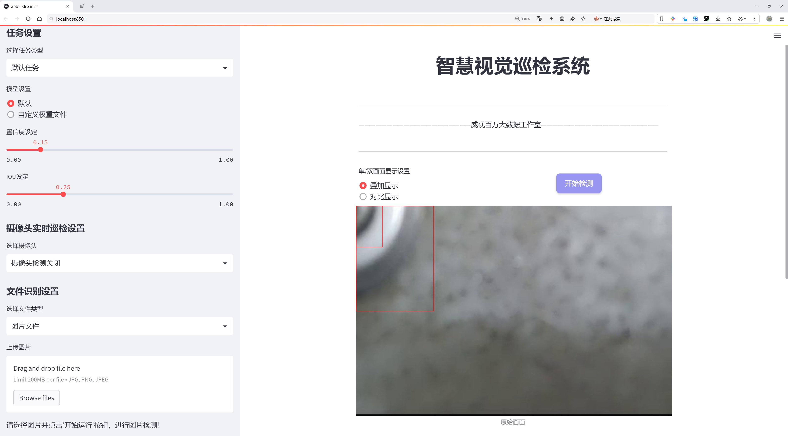
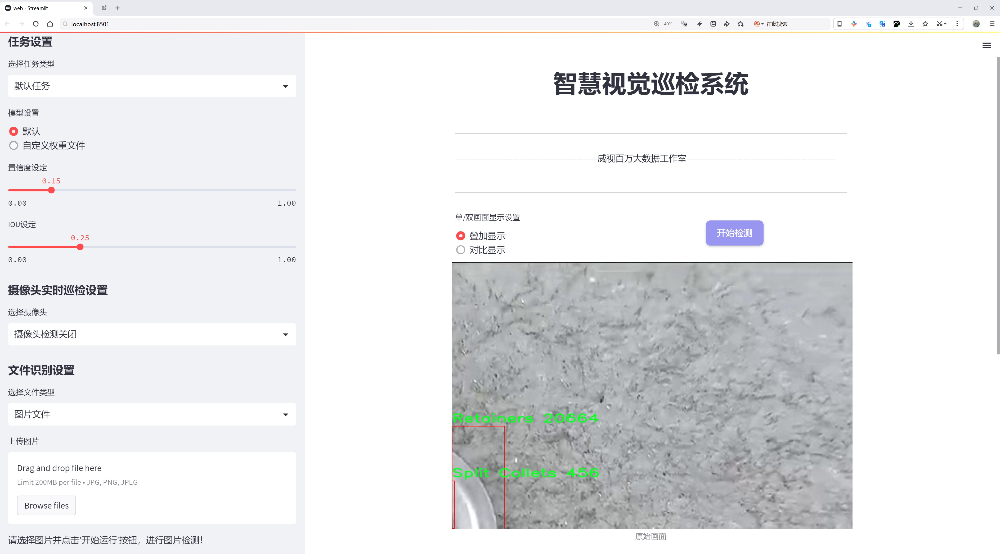
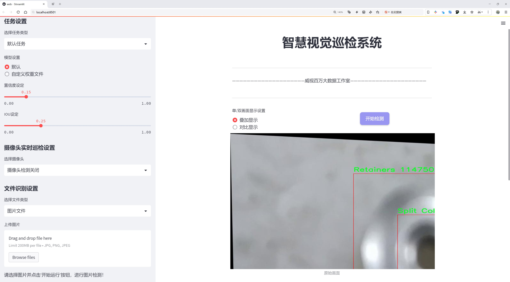
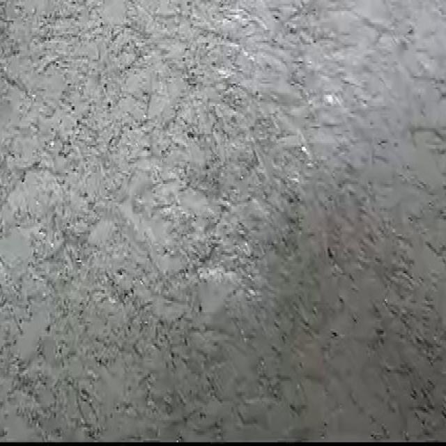
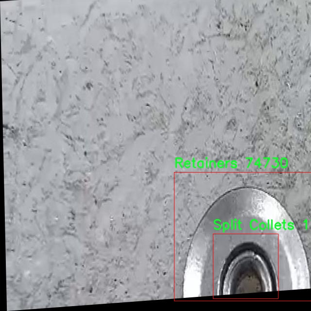
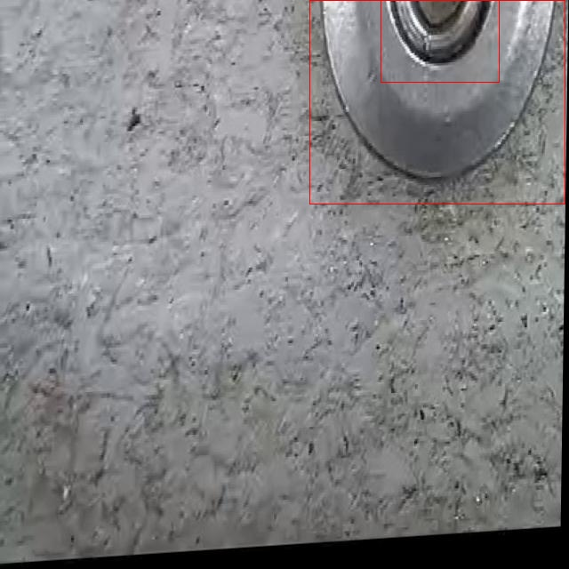
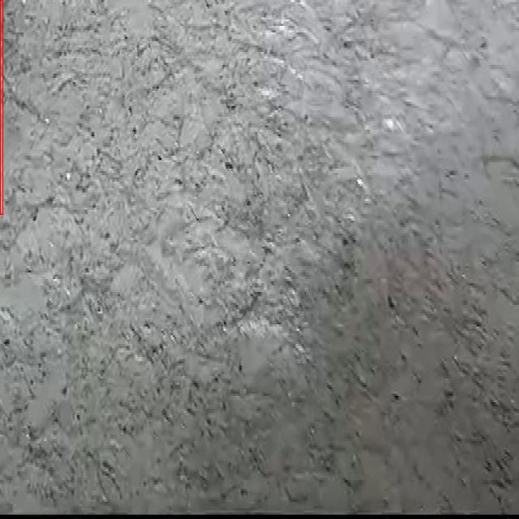

# 机械部件缺陷检测检测系统源码分享
 # [一条龙教学YOLOV8标注好的数据集一键训练_70+全套改进创新点发刊_Web前端展示]

### 1.研究背景与意义

项目参考[AAAI Association for the Advancement of Artificial Intelligence](https://gitee.com/qunmasj/projects)

项目来源[AACV Association for the Advancement of Computer Vision](https://kdocs.cn/l/cszuIiCKVNis)

研究背景与意义

随着工业自动化和智能制造的快速发展，机械部件的质量控制和缺陷检测已成为确保生产效率和产品可靠性的关键环节。传统的人工检测方法不仅耗时耗力，而且容易受到人为因素的影响，导致检测结果的不稳定性和不准确性。因此，采用先进的计算机视觉技术和深度学习算法来实现机械部件的自动化缺陷检测，已成为当前研究的热点之一。YOLO（You Only Look Once）系列模型因其高效的实时目标检测能力，逐渐成为工业领域中缺陷检测的首选工具。

在众多YOLO模型中，YOLOv8作为最新版本，具备了更强的特征提取能力和更快的推理速度，能够在复杂的工业环境中有效识别和定位各种机械部件的缺陷。然而，现有的YOLOv8模型在特定领域的应用仍存在一定的局限性，尤其是在机械部件缺陷检测方面。为此，基于改进YOLOv8的机械部件缺陷检测系统的研究显得尤为重要。

本研究所使用的数据集包含3600张图像，涵盖了五类机械部件：排气阀、保持器、分体夹头、弹簧和弹簧座垫圈。这些部件在机械系统中发挥着至关重要的作用，其缺陷可能导致整个机械系统的失效。因此，针对这些特定类别的缺陷检测，构建一个高效、准确的检测系统具有重要的实际意义。通过对数据集的深入分析与处理，可以为YOLOv8模型的改进提供有力的支持，提升其在机械部件缺陷检测中的性能。

此外，随着工业4.0和智能制造的不断推进，企业对生产过程的智能化、自动化要求日益提高。基于改进YOLOv8的缺陷检测系统，不仅能够提高检测效率，降低人工成本，还能在一定程度上减少因缺陷导致的经济损失，提升产品质量和企业竞争力。因此，研究基于改进YOLOv8的机械部件缺陷检测系统，不仅具有重要的学术价值，也具备广泛的应用前景。

综上所述，基于改进YOLOv8的机械部件缺陷检测系统的研究，旨在通过深度学习技术提升机械部件的检测精度和效率，推动智能制造的发展。通过对数据集的有效利用和模型的优化，期望能够为工业领域提供一种高效、可靠的缺陷检测解决方案，从而为企业的智能化转型提供技术支持。此项研究不仅将推动计算机视觉技术在工业应用中的深入发展，也将为相关领域的研究者提供新的思路和方法，具有重要的理论和实践意义。

### 2.图片演示







##### 注意：由于此博客编辑较早，上面“2.图片演示”和“3.视频演示”展示的系统图片或者视频可能为老版本，新版本在老版本的基础上升级如下：（实际效果以升级的新版本为准）

  （1）适配了YOLOV8的“目标检测”模型和“实例分割”模型，通过加载相应的权重（.pt）文件即可自适应加载模型。

  （2）支持“图片识别”、“视频识别”、“摄像头实时识别”三种识别模式。

  （3）支持“图片识别”、“视频识别”、“摄像头实时识别”三种识别结果保存导出，解决手动导出（容易卡顿出现爆内存）存在的问题，识别完自动保存结果并导出到tempDir中。

  （4）支持Web前端系统中的标题、背景图等自定义修改，后面提供修改教程。

  另外本项目提供训练的数据集和训练教程,暂不提供权重文件（best.pt）,需要您按照教程进行训练后实现图片演示和Web前端界面演示的效果。

### 3.视频演示

[3.1 视频演示](https://www.bilibili.com/video/BV1oKsheiEwt/)

### 4.数据集信息展示

##### 4.1 本项目数据集详细数据（类别数＆类别名）

nc: 5
names: ['Exhaust Valve', 'Retainers', 'Split Collets', 'Spring', 'Spring Seat Washer']


##### 4.2 本项目数据集信息介绍

数据集信息展示

在本研究中，我们采用了名为“sample2”的数据集，以支持改进YOLOv8的机械部件缺陷检测系统的训练和评估。该数据集专注于机械部件的缺陷识别，包含五个主要类别，分别是“Exhaust Valve”（排气阀）、“Retainers”（保持器）、“Split Collets”（分体夹头）、“Spring”（弹簧）和“Spring Seat Washer”（弹簧座垫圈）。这些类别涵盖了机械部件中常见的关键组件，旨在为缺陷检测提供全面的样本和多样化的场景。

“sample2”数据集的构建经过精心设计，确保其在训练过程中能够有效地提高YOLOv8模型的检测精度。每个类别的样本均经过严格筛选，确保其代表性和多样性。排气阀作为发动机的重要组成部分，其缺陷可能直接影响发动机的性能，因此在数据集中包含了多种不同状态和角度的排气阀图像，以便模型能够学习到不同缺陷特征的识别。此外，保持器、分体夹头、弹簧和弹簧座垫圈等部件也同样重要，它们在机械系统中起到关键的支撑和连接作用，任何微小的缺陷都可能导致系统的失效。

在数据集的构建过程中，所有图像均经过专业的标注，以确保每个类别的缺陷特征被准确识别。标注工作不仅包括对缺陷的定位，还涵盖了缺陷的类型和严重程度的分类。这种细致的标注方式使得“sample2”数据集在训练过程中能够提供丰富的上下文信息，帮助YOLOv8模型更好地理解和学习各类缺陷的特征。

此外，数据集的多样性也体现在不同的拍摄条件和环境下的样本选择上。为了增强模型的鲁棒性，数据集中包含了在不同光照、背景和视角下拍摄的图像。这种多样性不仅提高了模型对实际应用场景的适应能力，也使得其在处理不同类型的缺陷时能够保持较高的准确性。

在训练过程中，我们将使用“sample2”数据集进行多轮迭代，结合数据增强技术，以进一步提升模型的泛化能力。通过对数据集的深入分析和挖掘，我们期望能够在缺陷检测任务中实现更高的准确率和更低的误报率，从而为机械部件的质量控制提供强有力的技术支持。

综上所述，“sample2”数据集不仅为改进YOLOv8的机械部件缺陷检测系统提供了丰富的样本和多样化的场景，还通过精细的标注和多样的拍摄条件，为模型的训练和评估奠定了坚实的基础。我们相信，借助这一数据集的优势，改进后的YOLOv8模型将在机械部件缺陷检测领域展现出卓越的性能，为工业生产中的质量管理和故障预防提供更为有效的解决方案。










### 5.全套项目环境部署视频教程（零基础手把手教学）

[5.1 环境部署教程链接（零基础手把手教学）](https://www.ixigua.com/7404473917358506534?logTag=c807d0cbc21c0ef59de5)


[5.2 安装Python虚拟环境创建和依赖库安装视频教程链接（零基础手把手教学）](https://www.ixigua.com/7404474678003106304?logTag=1f1041108cd1f708b01a)

### 6.手把手YOLOV8训练视频教程（零基础小白有手就能学会）

[6.1 手把手YOLOV8训练视频教程（零基础小白有手就能学会）](https://www.ixigua.com/7404477157818401292?logTag=d31a2dfd1983c9668658)

### 7.70+种全套YOLOV8创新点代码加载调参视频教程（一键加载写好的改进模型的配置文件）

[7.1 70+种全套YOLOV8创新点代码加载调参视频教程（一键加载写好的改进模型的配置文件）](https://www.ixigua.com/7404478314661806627?logTag=29066f8288e3f4eea3a4)

### 8.70+种全套YOLOV8创新点原理讲解（非科班也可以轻松写刊发刊，V10版本正在科研待更新）

由于篇幅限制，每个创新点的具体原理讲解就不一一展开，具体见下列网址中的创新点对应子项目的技术原理博客网址【Blog】：


[8.1 70+种全套YOLOV8创新点原理讲解链接](https://gitee.com/qunmasj/good)

### 9.系统功能展示（检测对象为举例，实际内容以本项目数据集为准）

图9.1.系统支持检测结果表格显示

  图9.2.系统支持置信度和IOU阈值手动调节

  图9.3.系统支持自定义加载权重文件best.pt(需要你通过步骤5中训练获得)

  图9.4.系统支持摄像头实时识别

  图9.5.系统支持图片识别

  图9.6.系统支持视频识别

  图9.7.系统支持识别结果文件自动保存

  图9.8.系统支持Excel导出检测结果数据


### 10.原始YOLOV8算法原理

原始YOLOv8算法原理

YOLOv8作为目标检测领域的最新进展，继承并发展了前几代YOLO模型的优良特性，形成了一种高效、精确且易于训练的目标检测框架。其结构设计上，YOLOv8由输入层、主干网络、颈部网络和头部网络四个主要组件构成，这些组件相互协作，形成了一个完整的目标检测流程。该模型的输入层负责将原始图像进行缩放，以满足特定的输入尺寸要求，这一过程确保了后续特征提取和处理的高效性。

在主干网络中，YOLOv8采用了卷积操作进行图像的下采样，目的是提取出图像的深层特征。每个卷积层都配备了批归一化和SiLU激活函数，这种组合有效地提高了模型的收敛速度和稳定性。特别是，YOLOv8引入了C2f模块，该模块借鉴了YOLOv7中的E-ELAN结构，通过跨层分支连接来增强模型的梯度流。这种设计不仅改善了特征提取的效果，还在一定程度上缓解了深层网络中的梯度消失问题。主干网络的末尾，SPPFl模块通过三个最大池化层对多尺度特征进行处理，进一步增强了网络的特征抽象能力，使得模型在面对不同尺度的目标时能够保持良好的检测性能。

颈部网络的设计则利用了特征金字塔网络（FPN）和路径聚合网络（PAN）的结构，旨在融合来自不同尺度的特征图信息。通过这种特征融合，YOLOv8能够更好地捕捉到目标的多样性和复杂性，从而提高检测的准确性。颈部网络的输出被传递到头部网络，后者负责将融合后的特征图转换为具体的检测结果。YOLOv8的头部网络采用了解耦的检测头设计，分别通过两个并行的卷积分支计算回归和分类的损失，这种设计理念有效地提升了模型的灵活性和准确性。

与前几代YOLO模型相比，YOLOv8在多个方面进行了优化和改进。首先，YOLOv8抛弃了传统的Anchor-Base策略，转而采用Anchor-Free的思想，这一变化使得模型在处理不同形状和大小的目标时更加灵活。此外，YOLOv8在损失函数的设计上也进行了创新，使用了VFLLoss作为分类损失，并结合DFLLoss和CIoULoss来优化回归损失。这种多样化的损失函数设计，旨在解决样本不平衡和困难样本的问题，进一步提升了模型的检测性能。

在样本匹配策略上，YOLOv8采用了TaskAligned的Assigner匹配方式，这一新颖的匹配策略有助于提高训练效率和模型的泛化能力。为了增强模型的鲁棒性，YOLOv8在数据预处理阶段引入了多种数据增强手段，包括马赛克增强、混合增强、空间扰动和颜色扰动等。这些增强策略不仅丰富了训练样本的多样性，还有效地提升了模型的抗干扰能力。

C2f模块是YOLOv8的核心组成部分之一，其设计灵感来源于YOLOv5的C3模块和YOLOv7的ELAN结构。C2f模块通过引入多个分支和Bottleneck网络，增强了特征图的梯度流和信息传递能力，使得模型在深层特征提取时能够更有效地利用浅层特征。该模块的设计使得输入和输出特征图的尺寸保持一致，从而保证了特征的连续性和完整性。

在颈部网络中，YOLOv8采用了PAFPN结构，这一结构通过自下而上的特征融合，能够有效地整合浅层、中层和高层特征。PAFPN的设计不仅提高了特征融合的效率，还增强了模型对不同尺度目标的检测能力。最终，经过颈部网络处理后的特征图被送入头部网络，进行目标的分类和边框回归。

YOLOv8的头部网络采用了二阶段FCOS目标检测网络的Anchor-Free设计，解耦了分类和回归的分支。这一设计使得模型在进行目标检测时能够更加灵活地处理不同类型的目标，并提高了检测的精度。通过使用Distribution Focal Loss和CIoULoss，YOLOv8能够更好地应对样本不平衡的问题，确保模型在训练过程中的收敛性和稳定性。

综上所述，YOLOv8通过一系列创新的设计和优化，形成了一个高效、精确且易于训练的目标检测框架。其在特征提取、特征融合和目标检测等多个环节的改进，使得YOLOv8在目标检测任务中表现出色，成为当前业界最为流行和成功的模型之一。随着YOLOv8的不断发展和应用，未来在目标检测领域的潜力将更加广阔。


### 11.项目核心源码讲解（再也不用担心看不懂代码逻辑）

#### 11.1 code\ultralytics\utils\ops.py

以下是代码中最核心的部分，并附上详细的中文注释：

```python
import torch
import numpy as np
import torchvision

def non_max_suppression(
    prediction,
    conf_thres=0.25,
    iou_thres=0.45,
    classes=None,
    agnostic=False,
    multi_label=False,
    labels=(),
    max_det=300,
):
    """
    对一组边界框执行非最大抑制（NMS），支持掩码和每个框多个标签。

    Args:
        prediction (torch.Tensor): 形状为 (batch_size, num_classes + 4 + num_masks, num_boxes) 的张量，包含预测的框、类别和掩码。
        conf_thres (float): 置信度阈值，低于该值的框将被过滤。
        iou_thres (float): IoU阈值，低于该值的框在NMS过程中将被过滤。
        classes (List[int]): 要考虑的类别索引列表。如果为None，则考虑所有类别。
        agnostic (bool): 如果为True，模型对类别数量不敏感，所有类别将被视为一个。
        multi_label (bool): 如果为True，每个框可能有多个标签。
        labels (List[List[Union[int, float, torch.Tensor]]]): 每个图像的先验标签列表。
        max_det (int): NMS后要保留的最大框数。

    Returns:
        (List[torch.Tensor]): 长度为batch_size的列表，每个元素是形状为(num_boxes, 6 + num_masks)的张量，包含保留的框。
    """
    # 检查置信度和IoU阈值的有效性
    assert 0 <= conf_thres <= 1, f"Invalid Confidence threshold {conf_thres}, valid values are between 0.0 and 1.0"
    assert 0 <= iou_thres <= 1, f"Invalid IoU {iou_thres}, valid values are between 0.0 and 1.0"

    # 获取批次大小和类别数量
    bs = prediction.shape[0]  # 批次大小
    nc = prediction.shape[1] - 4  # 类别数量
    nm = prediction.shape[1] - nc - 4  # 掩码数量
    mi = 4 + nc  # 掩码起始索引
    xc = prediction[:, 4:mi].amax(1) > conf_thres  # 置信度候选框

    output = [torch.zeros((0, 6 + nm), device=prediction.device)] * bs  # 初始化输出

    for xi, x in enumerate(prediction):  # 遍历每个图像的预测结果
        x = x[xc[xi]]  # 根据置信度过滤框

        if not x.shape[0]:  # 如果没有框，继续下一个图像
            continue

        # 拆分边界框、类别和掩码
        box, cls, mask = x.split((4, nc, nm), 1)

        # 处理多标签情况
        if multi_label:
            i, j = torch.where(cls > conf_thres)  # 找到满足置信度的标签
            x = torch.cat((box[i], x[i, 4 + j, None], j[:, None].float(), mask[i]), 1)
        else:  # 仅保留最佳类别
            conf, j = cls.max(1, keepdim=True)
            x = torch.cat((box, conf, j.float(), mask), 1)[conf.view(-1) > conf_thres]

        # 过滤类别
        if classes is not None:
            x = x[(x[:, 5:6] == torch.tensor(classes, device=x.device)).any(1)]

        n = x.shape[0]  # 当前图像的框数量
        if not n:  # 如果没有框，继续下一个图像
            continue
        if n > max_det:  # 如果框数量超过最大限制，按置信度排序并保留前max_det个框
            x = x[x[:, 4].argsort(descending=True)[:max_det]]

        # 执行NMS
        boxes = x[:, :4]  # 获取边界框
        scores = x[:, 4]  # 获取置信度
        i = torchvision.ops.nms(boxes, scores, iou_thres)  # 应用NMS
        output[xi] = x[i]  # 保存结果

    return output  # 返回每个图像的NMS结果
```

### 代码分析
1. **非最大抑制 (NMS)**: 该函数的主要目的是在检测任务中，去除重叠的边界框，保留最有可能的框。
2. **参数说明**:
   - `prediction`: 包含所有预测框的张量。
   - `conf_thres`: 置信度阈值，低于该值的框将被过滤。
   - `iou_thres`: IoU阈值，用于判断框之间的重叠程度。
   - `classes`: 需要保留的类别索引。
   - `multi_label`: 是否支持每个框有多个标签。
3. **输出**: 返回每个图像的有效框列表，格式为 (x1, y1, x2, y2, confidence, class, mask)。

以上是代码的核心部分和详细注释，涵盖了非最大抑制的实现逻辑和参数说明。

这个文件是Ultralytics YOLO项目中的一个工具模块，主要用于处理与目标检测相关的操作，包括时间性能分析、坐标转换、非极大值抑制（NMS）、边界框缩放、掩码处理等功能。

首先，文件中定义了一个`Profile`类，用于性能分析。这个类可以作为装饰器或上下文管理器使用，能够记录代码块的执行时间。通过`__enter__`和`__exit__`方法，用户可以方便地测量某段代码的运行时间，并在最后输出结果。

接下来，文件中包含多个函数，用于处理边界框和分割掩码的转换和缩放。例如，`segment2box`函数将分割标签转换为边界框标签，`scale_boxes`函数则根据不同图像的尺寸对边界框进行缩放。`make_divisible`函数用于确保某个数能够被指定的除数整除，这在深度学习模型的构建中是常见的需求。

`nms_rotated`和`non_max_suppression`函数实现了非极大值抑制的算法，用于过滤重叠的边界框，以保留最有可能的检测结果。`clip_boxes`和`clip_coords`函数则用于将边界框和坐标限制在图像的边界内，确保它们不会超出图像的范围。

此外，文件中还实现了多种坐标格式之间的转换函数，例如`xyxy2xywh`和`xywh2xyxy`，这些函数可以在不同的坐标表示法之间进行转换，以适应不同的模型需求。

对于掩码处理，文件提供了`process_mask`、`process_mask_upsample`等函数，用于将掩码应用于边界框，并根据需要进行上采样。`masks2segments`函数则将掩码转换为分割线段，支持选择最大的分割区域或连接所有分割区域。

最后，文件中还包含一些实用的字符串处理函数，例如`clean_str`，用于清理字符串中的特殊字符。

总体来说，这个文件为YOLO目标检测模型提供了多种实用的工具函数，方便用户在进行目标检测时进行数据处理和后处理操作。

#### 11.2 code\ultralytics\solutions\ai_gym.py

以下是经过简化和注释的核心代码部分：

```python
import cv2
from ultralytics.utils.checks import check_imshow
from ultralytics.utils.plotting import Annotator

class AIGym:
    """管理实时视频流中人们的健身动作计数的类。"""

    def __init__(self):
        """初始化AIGym，设置视觉和图像参数的默认值。"""
        self.im0 = None  # 当前帧图像
        self.tf = None   # 线条厚度
        self.keypoints = None  # 关键点数据
        self.poseup_angle = None  # 上升姿势角度
        self.posedown_angle = None  # 下降姿势角度
        self.threshold = 0.001  # 阈值

        # 存储阶段、计数和角度信息
        self.angle = None
        self.count = None
        self.stage = None
        self.pose_type = "pushup"  # 默认姿势类型
        self.kpts_to_check = None  # 需要检查的关键点

        self.view_img = False  # 是否显示图像
        self.annotator = None  # 注释器实例

        # 检查环境是否支持imshow
        self.env_check = check_imshow(warn=True)

    def set_args(self, kpts_to_check, line_thickness=2, view_img=False, pose_up_angle=145.0, pose_down_angle=90.0, pose_type="pullup"):
        """
        配置AIGym的参数
        Args:
            kpts_to_check (list): 用于计数的3个关键点
            line_thickness (int): 边框的线条厚度
            view_img (bool): 是否显示图像
            pose_up_angle (float): 设置上升姿势的角度
            pose_down_angle (float): 设置下降姿势的角度
            pose_type: "pushup", "pullup" 或 "abworkout"
        """
        self.kpts_to_check = kpts_to_check
        self.tf = line_thickness
        self.view_img = view_img
        self.poseup_angle = pose_up_angle
        self.posedown_angle = pose_down_angle
        self.pose_type = pose_type

    def start_counting(self, im0, results, frame_count):
        """
        计数健身动作的函数
        Args:
            im0 (ndarray): 当前视频流的帧
            results: 姿势估计数据
            frame_count: 当前帧计数
        """
        self.im0 = im0  # 保存当前帧
        if frame_count == 1:
            # 初始化计数、角度和阶段
            self.count = [0] * len(results[0])
            self.angle = [0] * len(results[0])
            self.stage = ["-" for _ in results[0]]
        
        self.keypoints = results[0].keypoints.data  # 获取关键点数据
        self.annotator = Annotator(im0, line_width=2)  # 创建注释器实例

        num_keypoints = len(results[0])  # 关键点数量

        # 如果关键点数量发生变化，调整角度、计数和阶段的大小
        if len(self.angle) != num_keypoints:
            self.angle = [0] * num_keypoints
            self.count = [0] * num_keypoints
            self.stage = ["-" for _ in range(num_keypoints)]

        # 遍历每个关键点进行姿势估计和计数
        for ind, k in enumerate(reversed(self.keypoints)):
            # 计算姿势角度
            self.angle[ind] = self.annotator.estimate_pose_angle(
                k[int(self.kpts_to_check[0])].cpu(),
                k[int(self.kpts_to_check[1])].cpu(),
                k[int(self.kpts_to_check[2])].cpu(),
            )
            self.im0 = self.annotator.draw_specific_points(k, self.kpts_to_check, shape=(640, 640), radius=10)

            # 根据姿势类型更新阶段和计数
            if self.pose_type == "pushup":
                if self.angle[ind] > self.poseup_angle:
                    self.stage[ind] = "up"
                if self.angle[ind] < self.posedown_angle and self.stage[ind] == "up":
                    self.stage[ind] = "down"
                    self.count[ind] += 1

            elif self.pose_type == "pullup":
                if self.angle[ind] > self.poseup_angle:
                    self.stage[ind] = "down"
                if self.angle[ind] < self.posedown_angle and self.stage[ind] == "down":
                    self.stage[ind] = "up"
                    self.count[ind] += 1

            # 绘制角度、计数和阶段信息
            self.annotator.plot_angle_and_count_and_stage(
                angle_text=self.angle[ind],
                count_text=self.count[ind],
                stage_text=self.stage[ind],
                center_kpt=k[int(self.kpts_to_check[1])],
                line_thickness=self.tf,
            )

            # 绘制关键点
            self.annotator.kpts(k, shape=(640, 640), radius=1, kpt_line=True)

        # 如果环境支持并且需要显示图像，则展示当前帧
        if self.env_check and self.view_img:
            cv2.imshow("Ultralytics YOLOv8 AI GYM", self.im0)
            if cv2.waitKey(1) & 0xFF == ord("q"):
                return

        return self.im0  # 返回处理后的图像

if __name__ == "__main__":
    AIGym()  # 实例化AIGym类
```

### 代码说明：
1. **类定义**：`AIGym`类用于管理健身动作的计数。
2. **初始化方法**：设置默认参数和状态。
3. **设置参数方法**：允许用户配置关键点、线条厚度、是否显示图像等参数。
4. **计数方法**：根据视频流中的姿势估计数据进行动作计数和状态更新，并绘制相关信息。

这个程序文件定义了一个名为 `AIGym` 的类，旨在通过实时视频流监测和计数人们的健身动作，主要针对俯卧撑、引体向上和腹部锻炼等动作。以下是对代码的详细讲解。

首先，程序导入了必要的库，包括 `cv2`（OpenCV库，用于图像处理）以及 `ultralytics` 中的一些工具函数。`check_imshow` 用于检查当前环境是否支持图像显示，而 `Annotator` 则用于在图像上绘制标注。

在 `AIGym` 类的构造函数 `__init__` 中，初始化了一些默认值，包括图像参数、关键点信息、角度阈值、计数和阶段信息等。`pose_type` 用于指定当前的健身动作类型，初始值为 "pushup"。同时，调用 `check_imshow` 来确认环境支持图像显示。

`set_args` 方法用于配置 `AIGym` 的参数，包括需要检查的关键点、线条厚度、是否显示图像、上举和下放的角度阈值，以及动作类型。这个方法允许用户根据不同的需求调整参数。

`start_counting` 方法是核心功能，用于在每一帧中计数健身动作。它接收当前帧图像、姿态估计结果和帧计数作为输入。方法首先将当前帧图像赋值给 `im0`，并在第一帧时初始化计数、角度和阶段信息。接着，它提取关键点数据，并使用 `Annotator` 创建一个可用于绘制的对象。

在循环中，程序会根据不同的动作类型（俯卧撑、引体向上、腹部锻炼）计算关键点之间的角度，并更新动作的阶段和计数。每种动作都有特定的逻辑来判断何时完成一次动作并进行计数。计算出的角度、计数和阶段信息会通过 `Annotator` 绘制到图像上。

最后，如果环境支持图像显示且用户选择了显示图像，程序会使用 OpenCV 显示当前帧图像，并在按下 "q" 键时退出显示。

整个程序的设计使得用户能够实时监测和计数特定的健身动作，结合计算机视觉技术来提升健身体验。

#### 11.3 ui.py

```python
import sys
import subprocess

def run_script(script_path):
    """
    使用当前 Python 环境运行指定的脚本。

    Args:
        script_path (str): 要运行的脚本路径

    Returns:
        None
    """
    # 获取当前 Python 解释器的路径
    python_path = sys.executable

    # 构建运行命令，使用 streamlit 运行指定的脚本
    command = f'"{python_path}" -m streamlit run "{script_path}"'

    # 执行命令并等待其完成
    result = subprocess.run(command, shell=True)
    
    # 检查命令执行的返回码，如果不为0，表示出错
    if result.returncode != 0:
        print("脚本运行出错。")


# 实例化并运行应用
if __name__ == "__main__":
    # 指定要运行的脚本路径
    script_path = "web.py"  # 假设脚本在当前目录下

    # 调用函数运行脚本
    run_script(script_path)
```

### 代码注释说明：
1. **导入模块**：
   - `sys`：用于获取当前 Python 解释器的路径。
   - `subprocess`：用于执行外部命令。

2. **定义 `run_script` 函数**：
   - 该函数接收一个参数 `script_path`，表示要运行的 Python 脚本的路径。
   - 使用 `sys.executable` 获取当前 Python 解释器的路径，以便在命令中调用。
   - 构建一个命令字符串，使用 `streamlit` 模块运行指定的脚本。
   - 使用 `subprocess.run` 执行构建的命令，并等待其完成。
   - 检查命令的返回码，如果返回码不为0，表示脚本运行出错，打印错误信息。

3. **主程序入口**：
   - 使用 `if __name__ == "__main__":` 确保只有在直接运行该脚本时才会执行以下代码。
   - 指定要运行的脚本路径为 `web.py`。
   - 调用 `run_script` 函数来运行指定的脚本。

这个程序文件名为 `ui.py`，其主要功能是使用当前的 Python 环境来运行一个指定的脚本，具体是一个名为 `web.py` 的文件。程序首先导入了必要的模块，包括 `sys`、`os` 和 `subprocess`，以及一个自定义的 `abs_path` 函数，这个函数可能用于获取文件的绝对路径。

在 `run_script` 函数中，程序接收一个参数 `script_path`，这个参数是要运行的脚本的路径。函数首先获取当前 Python 解释器的路径，这通过 `sys.executable` 实现。接着，程序构建了一个命令字符串，使用 `streamlit` 来运行指定的脚本。`streamlit` 是一个用于构建数据应用的框架。

然后，程序使用 `subprocess.run` 来执行这个命令，`shell=True` 表示命令将在一个新的 shell 中运行。执行完命令后，程序检查返回码，如果返回码不为零，说明脚本运行过程中出现了错误，此时会打印出“脚本运行出错”的提示。

在文件的最后部分，程序通过 `if __name__ == "__main__":` 来判断是否是直接运行该脚本。如果是，程序会调用 `abs_path` 函数来获取 `web.py` 的绝对路径，并将其传递给 `run_script` 函数，从而启动该脚本的执行。

总体来看，这个程序的结构清晰，功能单一，主要用于启动一个基于 Streamlit 的 web 应用。

#### 11.4 70+种YOLOv8算法改进源码大全和调试加载训练教程（非必要）\ultralytics\data\build.py

以下是代码中最核心的部分，并附上详细的中文注释：

```python
import os
import random
import numpy as np
import torch
from torch.utils.data import dataloader, distributed
from .dataset import YOLODataset
from .utils import PIN_MEMORY

class InfiniteDataLoader(dataloader.DataLoader):
    """
    无限数据加载器，重用工作线程。
    语法与普通的 DataLoader 相同。
    """

    def __init__(self, *args, **kwargs):
        """初始化无限数据加载器，继承自 DataLoader。"""
        super().__init__(*args, **kwargs)
        # 使用 _RepeatSampler 使得 batch_sampler 可以无限重复
        object.__setattr__(self, 'batch_sampler', _RepeatSampler(self.batch_sampler))
        self.iterator = super().__iter__()

    def __len__(self):
        """返回 batch_sampler 的长度。"""
        return len(self.batch_sampler.sampler)

    def __iter__(self):
        """创建一个无限重复的采样器。"""
        for _ in range(len(self)):
            yield next(self.iterator)

    def reset(self):
        """
        重置迭代器。
        当我们想在训练过程中修改数据集设置时，这个方法非常有用。
        """
        self.iterator = self._get_iterator()


class _RepeatSampler:
    """
    无限重复的采样器。
    
    参数:
        sampler (Dataset.sampler): 要重复的采样器。
    """

    def __init__(self, sampler):
        """初始化一个无限重复给定采样器的对象。"""
        self.sampler = sampler

    def __iter__(self):
        """迭代 'sampler' 并返回其内容。"""
        while True:
            yield from iter(self.sampler)


def seed_worker(worker_id):
    """设置数据加载器工作线程的随机种子。"""
    worker_seed = torch.initial_seed() % 2 ** 32  # 获取当前的随机种子
    np.random.seed(worker_seed)  # 设置 numpy 随机种子
    random.seed(worker_seed)  # 设置 random 随机种子


def build_yolo_dataset(cfg, img_path, batch, data, mode='train', rect=False, stride=32):
    """构建 YOLO 数据集。"""
    return YOLODataset(
        img_path=img_path,
        imgsz=cfg.imgsz,  # 图像大小
        batch_size=batch,  # 批次大小
        augment=mode == 'train',  # 是否进行数据增强
        hyp=cfg,  # 超参数配置
        rect=cfg.rect or rect,  # 是否使用矩形批次
        cache=cfg.cache or None,  # 是否缓存数据
        single_cls=cfg.single_cls or False,  # 是否单类检测
        stride=int(stride),  # 步幅
        pad=0.0 if mode == 'train' else 0.5,  # 填充
        prefix=colorstr(f'{mode}: '),  # 模式前缀
        use_segments=cfg.task == 'segment',  # 是否使用分割
        use_keypoints=cfg.task == 'pose',  # 是否使用关键点
        classes=cfg.classes,  # 类别
        data=data,  # 数据配置
        fraction=cfg.fraction if mode == 'train' else 1.0  # 训练时的数据比例
    )


def build_dataloader(dataset, batch, workers, shuffle=True, rank=-1):
    """返回用于训练或验证集的 InfiniteDataLoader 或 DataLoader。"""
    batch = min(batch, len(dataset))  # 确保批次大小不超过数据集大小
    nd = torch.cuda.device_count()  # 获取 CUDA 设备数量
    nw = min([os.cpu_count() // max(nd, 1), batch if batch > 1 else 0, workers])  # 计算工作线程数量
    sampler = None if rank == -1 else distributed.DistributedSampler(dataset, shuffle=shuffle)  # 分布式采样器
    generator = torch.Generator()  # 创建随机数生成器
    generator.manual_seed(6148914691236517205 + RANK)  # 设置随机种子
    return InfiniteDataLoader(dataset=dataset,
                              batch_size=batch,
                              shuffle=shuffle and sampler is None,
                              num_workers=nw,
                              sampler=sampler,
                              pin_memory=PIN_MEMORY,
                              collate_fn=getattr(dataset, 'collate_fn', None),
                              worker_init_fn=seed_worker,
                              generator=generator)  # 返回无限数据加载器


def check_source(source):
    """检查源类型并返回相应的标志值。"""
    webcam, screenshot, from_img, in_memory, tensor = False, False, False, False, False
    if isinstance(source, (str, int, Path)):  # 如果是字符串、整数或路径
        source = str(source)
        is_file = Path(source).suffix[1:] in (IMG_FORMATS + VID_FORMATS)  # 检查是否为文件
        is_url = source.lower().startswith(('https://', 'http://', 'rtsp://', 'rtmp://', 'tcp://'))  # 检查是否为 URL
        webcam = source.isnumeric() or source.endswith('.streams') or (is_url and not is_file)  # 检查是否为摄像头
        screenshot = source.lower() == 'screen'  # 检查是否为屏幕截图
        if is_url and is_file:
            source = check_file(source)  # 下载文件
    elif isinstance(source, LOADERS):
        in_memory = True  # 如果是加载器，则标记为内存
    elif isinstance(source, (list, tuple)):
        source = autocast_list(source)  # 将列表元素转换为 PIL 或 np 数组
        from_img = True
    elif isinstance(source, (Image.Image, np.ndarray)):
        from_img = True  # 如果是图像或数组
    elif isinstance(source, torch.Tensor):
        tensor = True  # 如果是张量
    else:
        raise TypeError('不支持的图像类型。支持的类型请参见文档。')

    return source, webcam, screenshot, from_img, in_memory, tensor


def load_inference_source(source=None, imgsz=640, vid_stride=1, buffer=False):
    """
    加载用于目标检测的推理源并应用必要的转换。

    参数:
        source (str, Path, Tensor, PIL.Image, np.ndarray): 输入推理源。
        imgsz (int, optional): 推理图像的大小。默认是 640。
        vid_stride (int, optional): 视频源的帧间隔。默认是 1。
        buffer (bool, optional): 确定流帧是否会被缓冲。默认是 False。

    返回:
        dataset (Dataset): 指定输入源的数据集对象。
    """
    source, webcam, screenshot, from_img, in_memory, tensor = check_source(source)  # 检查源类型
    source_type = source.source_type if in_memory else SourceTypes(webcam, screenshot, from_img, tensor)  # 获取源类型

    # 数据加载器
    if tensor:
        dataset = LoadTensor(source)  # 如果是张量，加载张量
    elif in_memory:
        dataset = source  # 如果在内存中，直接使用源
    elif webcam:
        dataset = LoadStreams(source, imgsz=imgsz, vid_stride=vid_stride, buffer=buffer)  # 如果是摄像头，加载流
    elif screenshot:
        dataset = LoadScreenshots(source, imgsz=imgsz)  # 如果是屏幕截图，加载截图
    elif from_img:
        dataset = LoadPilAndNumpy(source, imgsz=imgsz)  # 如果是图像，加载图像
    else:
        dataset = LoadImages(source, imgsz=imgsz, vid_stride=vid_stride)  # 否则加载图像

    # 将源类型附加到数据集
    setattr(dataset, 'source_type', source_type)

    return dataset  # 返回数据集
```

以上代码实现了一个无限数据加载器和相关的辅助函数，用于构建和加载 YOLO 数据集，支持多种数据源类型，并能够处理数据增强和分布式训练。

这个程序文件是一个用于构建YOLO（You Only Look Once）算法数据加载器的模块，主要涉及数据集的构建和加载，以便在训练和推理过程中使用。代码中包含了多个类和函数，具体功能如下：

首先，文件导入了一些必要的库，包括操作系统相关的库、随机数生成库、路径处理库、NumPy、PyTorch以及一些YOLO相关的模块。这些库为后续的数据处理和模型训练提供了支持。

`InfiniteDataLoader`类是一个自定义的数据加载器，继承自PyTorch的`DataLoader`。它的特点是可以无限循环使用工作线程，这对于需要重复训练的场景非常有用。该类重写了`__len__`和`__iter__`方法，使得每次迭代都能返回新的批次数据。此外，它还提供了`reset`方法，用于在训练过程中重置迭代器，以便可以在训练时修改数据集的设置。

`_RepeatSampler`类是一个采样器，用于无限重复给定的采样器。它的`__iter__`方法实现了一个无限循环，能够不断返回原始采样器的内容。

`seed_worker`函数用于设置数据加载器工作线程的随机种子，以确保每次训练的随机性可控，避免数据顺序的随机性对训练结果造成影响。

`build_yolo_dataset`函数用于构建YOLO数据集，接受多个参数，包括配置、图像路径、批次大小等。根据不同的模式（训练或验证），该函数会设置数据增强、批次类型、缓存等参数，并返回一个`YOLODataset`对象。

`build_dataloader`函数用于返回一个`InfiniteDataLoader`或`DataLoader`，具体取决于传入的数据集和其他参数。它会根据可用的CUDA设备数量和CPU核心数量来确定工作线程的数量，并支持分布式训练。

`check_source`函数用于检查输入源的类型，并返回相应的标志值。这包括检查输入是否为文件、URL、摄像头、内存中的数据等，以便后续的处理。

`load_inference_source`函数用于加载推理源，接受多个参数，如输入源、图像大小、视频帧间隔等。根据输入源的类型，它会调用不同的加载器（如`LoadImages`、`LoadStreams`等）来处理数据，并返回一个数据集对象。

总体来说，这个文件提供了YOLO算法所需的数据加载和处理功能，为模型的训练和推理提供了基础。通过灵活的设计，用户可以根据自己的需求调整数据集和加载器的行为。

#### 11.5 70+种YOLOv8算法改进源码大全和调试加载训练教程（非必要）\ultralytics\utils\plotting.py

以下是代码中最核心的部分，并附上详细的中文注释：

```python
class Colors:
    """
    Ultralytics 默认颜色调色板。

    该类提供了与 Ultralytics 颜色调色板相关的方法，包括将十六进制颜色代码转换为 RGB 值。

    属性:
        palette (list of tuple): RGB 颜色值列表。
        n (int): 调色板中的颜色数量。
        pose_palette (np.array): 特定的颜色调色板数组，数据类型为 np.uint8。
    """

    def __init__(self):
        """初始化颜色为十六进制值，即 matplotlib.colors.TABLEAU_COLORS.values()。"""
        hexs = ('FF3838', 'FF9D97', 'FF701F', 'FFB21D', 'CFD231', '48F90A', '92CC17', '3DDB86', '1A9334', '00D4BB',
                '2C99A8', '00C2FF', '344593', '6473FF', '0018EC', '8438FF', '520085', 'CB38FF', 'FF95C8', 'FF37C7')
        self.palette = [self.hex2rgb(f'#{c}') for c in hexs]  # 将十六进制颜色转换为 RGB
        self.n = len(self.palette)  # 颜色数量
        self.pose_palette = np.array([[255, 128, 0], [255, 153, 51], [255, 178, 102], [230, 230, 0], [255, 153, 255],
                                      [153, 204, 255], [255, 102, 255], [255, 51, 255], [102, 178, 255], [51, 153, 255],
                                      [255, 153, 153], [255, 102, 102], [255, 51, 51], [153, 255, 153], [102, 255, 102],
                                      [51, 255, 51], [0, 255, 0], [0, 0, 255], [255, 0, 0], [255, 255, 255]],
                                     dtype=np.uint8)  # 特定的姿态颜色调色板

    def __call__(self, i, bgr=False):
        """将十六进制颜色代码转换为 RGB 值。"""
        c = self.palette[int(i) % self.n]  # 获取颜色
        return (c[2], c[1], c[0]) if bgr else c  # 返回 BGR 或 RGB

    @staticmethod
    def hex2rgb(h):
        """将十六进制颜色代码转换为 RGB 值（即默认的 PIL 顺序）。"""
        return tuple(int(h[1 + i:1 + i + 2], 16) for i in (0, 2, 4))  # 转换为 RGB 元组


class Annotator:
    """
    Ultralytics 注释器，用于训练/验证马赛克和 JPG 以及预测注释。

    属性:
        im (Image.Image 或 numpy array): 要注释的图像。
        pil (bool): 是否使用 PIL 或 cv2 绘制注释。
        font (ImageFont.truetype 或 ImageFont.load_default): 用于文本注释的字体。
        lw (float): 绘制的线宽。
        skeleton (List[List[int]]): 关键点的骨架结构。
        limb_color (List[int]): 四肢的颜色调色板。
        kpt_color (List[int]): 关键点的颜色调色板。
    """

    def __init__(self, im, line_width=None, font_size=None, font='Arial.ttf', pil=False, example='abc'):
        """初始化 Annotator 类，传入图像、线宽以及关键点和四肢的颜色调色板。"""
        assert im.data.contiguous, '图像不连续。请对 Annotator() 输入图像应用 np.ascontiguousarray(im)。'
        non_ascii = not is_ascii(example)  # 检查示例是否为非 ASCII 字符
        self.pil = pil or non_ascii  # 根据情况选择使用 PIL
        self.lw = line_width or max(round(sum(im.shape) / 2 * 0.003), 2)  # 计算线宽
        if self.pil:  # 使用 PIL
            self.im = im if isinstance(im, Image.Image) else Image.fromarray(im)  # 转换为 PIL 图像
            self.draw = ImageDraw.Draw(self.im)  # 创建绘图对象
            try:
                font = check_font('Arial.Unicode.ttf' if non_ascii else font)  # 检查字体
                size = font_size or max(round(sum(self.im.size) / 2 * 0.035), 12)  # 计算字体大小
                self.font = ImageFont.truetype(str(font), size)  # 加载字体
            except Exception:
                self.font = ImageFont.load_default()  # 加载默认字体
        else:  # 使用 cv2
            self.im = im
            self.tf = max(self.lw - 1, 1)  # 字体厚度
            self.sf = self.lw / 3  # 字体缩放
        # 骨架结构
        self.skeleton = [[16, 14], [14, 12], [17, 15], [15, 13], [12, 13], [6, 12], [7, 13], [6, 7], [6, 8], [7, 9],
                         [8, 10], [9, 11], [2, 3], [1, 2], [1, 3], [2, 4], [3, 5], [4, 6], [5, 7]]

        self.limb_color = colors.pose_palette[[9, 9, 9, 9, 7, 7, 7, 0, 0, 0, 0, 0, 16, 16, 16, 16, 16, 16, 16]]  # 四肢颜色
        self.kpt_color = colors.pose_palette[[16, 16, 16, 16, 16, 0, 0, 0, 0, 0, 0, 9, 9, 9, 9, 9, 9]]  # 关键点颜色

    def box_label(self, box, label='', color=(128, 128, 128), txt_color=(255, 255, 255)):
        """在图像上添加一个 xyxy 矩形框及其标签。"""
        if isinstance(box, torch.Tensor):
            box = box.tolist()  # 转换为列表
        if self.pil or not is_ascii(label):
            self.draw.rectangle(box, width=self.lw, outline=color)  # 绘制矩形框
            if label:
                w, h = self.font.getsize(label)  # 获取文本宽度和高度
                outside = box[1] - h >= 0  # 标签是否适合框外
                self.draw.rectangle(
                    (box[0], box[1] - h if outside else box[1], box[0] + w + 1,
                     box[1] + 1 if outside else box[1] + h + 1),
                    fill=color,
                )  # 绘制标签背景
                self.draw.text((box[0], box[1] - h if outside else box[1]), label, fill=txt_color, font=self.font)  # 绘制文本
        else:  # 使用 cv2
            p1, p2 = (int(box[0]), int(box[1])), (int(box[2]), int(box[3]))
            cv2.rectangle(self.im, p1, p2, color, thickness=self.lw, lineType=cv2.LINE_AA)  # 绘制矩形框
            if label:
                w, h = cv2.getTextSize(label, 0, fontScale=self.sf, thickness=self.tf)[0]  # 获取文本宽度和高度
                outside = p1[1] - h >= 3
                p2 = p1[0] + w, p1[1] - h - 3 if outside else p1[1] + h + 3
                cv2.rectangle(self.im, p1, p2, color, -1, cv2.LINE_AA)  # 填充背景
                cv2.putText(self.im,
                            label, (p1[0], p1[1] - 2 if outside else p1[1] + h + 2),
                            0,
                            self.sf,
                            txt_color,
                            thickness=self.tf,
                            lineType=cv2.LINE_AA)  # 绘制文本

    def result(self):
        """返回带注释的图像作为数组。"""
        return np.asarray(self.im)  # 转换为 numpy 数组并返回
```

### 代码说明：
1. **Colors 类**：用于管理颜色调色板，包括初始化颜色、转换颜色格式等功能。
2. **Annotator 类**：用于在图像上绘制矩形框、文本、关键点等注释，支持使用 PIL 或 OpenCV 进行绘制。
3. **box_label 方法**：在图像上绘制矩形框及其标签，支持不同的绘制方式（PIL 或 OpenCV）。

这些核心部分为图像注释和可视化提供了基础功能，适用于目标检测等任务。

这个程序文件是Ultralytics YOLO（You Only Look Once）算法的一个重要组成部分，主要用于图像的可视化和注释。代码中定义了多个类和函数，旨在帮助用户在训练和推理过程中对图像进行标注、绘制统计图表以及保存图像等操作。

首先，`Colors`类定义了一组颜色，用于在图像中标注不同的对象。它通过将十六进制颜色代码转换为RGB值来初始化颜色调色板，并提供了一个调用方法来获取特定索引的颜色。这个类还定义了一种特定的颜色调色板，用于关键点的可视化。

接下来，`Annotator`类用于在图像上绘制边界框、关键点和其他注释。它支持使用PIL或OpenCV进行绘制，允许用户自定义线宽、字体和颜色。该类提供了多种方法，例如`box_label`用于绘制边界框及其标签，`masks`用于绘制分割掩码，`kpts`用于绘制关键点，`rectangle`和`text`方法用于绘制矩形和文本。

此外，文件中还定义了一些函数，如`plot_labels`用于绘制训练标签的统计图，`save_one_box`用于根据边界框保存图像的裁剪部分，`plot_images`用于绘制带有标签的图像网格，`plot_results`用于从CSV文件中绘制训练结果，`plt_color_scatter`用于绘制带有颜色映射的散点图，以及`output_to_target`用于将模型输出转换为目标格式。

整体而言，这个文件为YOLOv8算法提供了丰富的可视化工具，方便用户在训练和推理过程中进行结果分析和展示。通过这些工具，用户可以更直观地理解模型的性能和数据分布，从而更好地进行模型调优和改进。

#### 11.6 code\ultralytics\hub\utils.py

以下是经过简化和注释的核心代码部分：

```python
import os
import platform
import random
import sys
import threading
import time
from pathlib import Path
import requests
from ultralytics.utils import (
    ENVIRONMENT,
    LOGGER,
    RANK,
    SETTINGS,
    ONLINE,
    __version__,
    is_git_dir,
    is_pip_package,
)

# 定义Hub API和Web的根URL
HUB_API_ROOT = os.environ.get("ULTRALYTICS_HUB_API", "https://api.ultralytics.com")
HUB_WEB_ROOT = os.environ.get("ULTRALYTICS_HUB_WEB", "https://hub.ultralytics.com")

# 定义请求的基本信息
PREFIX = "Ultralytics HUB: "
HELP_MSG = "如果此问题持续存在，请访问 https://github.com/ultralytics/hub/issues 寻求帮助。"

def requests_with_progress(method, url, **kwargs):
    """
    使用指定的方法和URL进行HTTP请求，并可选地显示进度条。

    参数:
        method (str): 使用的HTTP方法（例如 'GET', 'POST'）。
        url (str): 发送请求的URL。
        **kwargs (dict): 传递给requests.request函数的其他关键字参数。

    返回:
        (requests.Response): HTTP请求的响应对象。
    """
    progress = kwargs.pop("progress", False)  # 从kwargs中提取进度参数
    if not progress:
        return requests.request(method, url, **kwargs)  # 如果没有进度条，直接请求

    # 否则，使用流式请求并显示进度条
    response = requests.request(method, url, stream=True, **kwargs)
    total = int(response.headers.get("content-length", 0))  # 获取响应内容的总大小
    try:
        pbar = TQDM(total=total, unit="B", unit_scale=True, unit_divisor=1024)  # 初始化进度条
        for data in response.iter_content(chunk_size=1024):  # 分块读取响应内容
            pbar.update(len(data))  # 更新进度条
        pbar.close()  # 关闭进度条
    except requests.exceptions.ChunkedEncodingError:  # 处理连接中断的异常
        response.close()
    return response  # 返回响应对象

def smart_request(method, url, retry=3, timeout=30, thread=True, verbose=True, progress=False, **kwargs):
    """
    使用'requests'库进行HTTP请求，支持重试和超时设置。

    参数:
        method (str): 请求使用的HTTP方法。
        url (str): 请求的URL。
        retry (int): 失败后重试的次数，默认为3。
        timeout (int): 超时时间（秒），默认为30。
        thread (bool): 是否在单独的线程中执行请求，默认为True。
        verbose (bool): 是否打印详细信息，默认为True。
        progress (bool): 是否在请求过程中显示进度条，默认为False。
        **kwargs (dict): 传递给requests函数的其他关键字参数。

    返回:
        (requests.Response): HTTP响应对象。
    """
    retry_codes = (408, 500)  # 需要重试的HTTP状态码

    def func(func_method, func_url, **func_kwargs):
        """执行HTTP请求，支持重试和超时，带有可选的进度跟踪。"""
        r = None  # 初始化响应对象
        t0 = time.time()  # 记录开始时间
        for i in range(retry + 1):
            if (time.time() - t0) > timeout:  # 超过超时时间，停止重试
                break
            r = requests_with_progress(func_method, func_url, **func_kwargs)  # 发起请求
            if r.status_code < 300:  # 如果响应状态码在2xx范围内，表示成功
                break
            if i == 0 and verbose:
                LOGGER.warning(f"{PREFIX}请求失败，状态码: {r.status_code} {HELP_MSG}")  # 打印警告信息
            time.sleep(2**i)  # 指数退避策略
        return r  # 返回响应对象

    args = method, url
    kwargs["progress"] = progress  # 将进度参数传递给func
    if thread:
        threading.Thread(target=func, args=args, kwargs=kwargs, daemon=True).start()  # 在新线程中执行
    else:
        return func(*args, **kwargs)  # 直接执行请求

class Events:
    """
    用于收集匿名事件分析的类。事件分析在设置中sync=True时启用，sync=False时禁用。

    属性:
        url (str): 发送匿名事件的URL。
        rate_limit (float): 发送事件的速率限制（秒）。
        metadata (dict): 包含环境元数据的字典。
        enabled (bool): 根据特定条件启用或禁用事件。
    """

    url = "https://www.google-analytics.com/mp/collect?measurement_id=G-X8NCJYTQXM&api_secret=QLQrATrNSwGRFRLE-cbHJw"

    def __init__(self):
        """初始化Events对象，设置事件、速率限制和元数据的默认值。"""
        self.events = []  # 事件列表
        self.rate_limit = 60.0  # 速率限制（秒）
        self.t = 0.0  # 速率限制计时器（秒）
        self.metadata = {
            "cli": Path(sys.argv[0]).name == "yolo",
            "install": "git" if is_git_dir() else "pip" if is_pip_package() else "other",
            "python": ".".join(platform.python_version_tuple()[:2]),  # Python版本
            "version": __version__,
            "env": ENVIRONMENT,
            "session_id": round(random.random() * 1e15),  # 随机会话ID
            "engagement_time_msec": 1000,
        }
        self.enabled = (
            SETTINGS["sync"]
            and RANK in (-1, 0)
            and not TESTS_RUNNING
            and ONLINE
            and (is_pip_package() or is_git_dir())
        )

    def __call__(self, cfg):
        """
        尝试将新事件添加到事件列表，并在达到速率限制时发送事件。

        参数:
            cfg (IterableSimpleNamespace): 包含模式和任务信息的配置对象。
        """
        if not self.enabled:
            return  # 如果事件禁用，则不执行任何操作

        # 尝试添加事件
        if len(self.events) < 25:  # 事件列表限制为25个事件
            params = {
                **self.metadata,
                "task": cfg.task,
                "model": cfg.model if cfg.model in GITHUB_ASSETS_NAMES else "custom",
            }
            self.events.append({"name": cfg.mode, "params": params})  # 添加事件

        # 检查速率限制
        t = time.time()
        if (t - self.t) < self.rate_limit:
            return  # 如果时间未超过速率限制，则返回

        # 超过速率限制，发送事件
        data = {"client_id": SETTINGS["uuid"], "events": self.events}  # 客户端ID和事件列表
        smart_request("post", self.url, json=data, retry=0, verbose=False)  # 发送POST请求

        # 重置事件和速率限制计时器
        self.events = []
        self.t = t

# 初始化事件对象
events = Events()
```

### 代码说明：
1. **导入模块**：导入所需的标准库和Ultralytics库中的工具。
2. **请求函数**：`requests_with_progress`和`smart_request`函数用于处理HTTP请求，支持进度条和重试机制。
3. **事件类**：`Events`类用于收集和发送匿名事件分析数据，包含事件的元数据和发送逻辑。
4. **初始化**：最后创建`Events`类的实例以便后续使用。

这个程序文件是Ultralytics YOLO项目中的一个工具模块，主要用于处理与Ultralytics Hub的交互，包括HTTP请求、事件收集和进度显示等功能。首先，文件导入了一些必要的库和模块，包括操作系统、网络请求、时间处理等，同时还引入了Ultralytics项目中的一些工具函数和常量。

文件定义了两个主要的API根URL，分别用于Hub的API和Web访问，这些URL可以通过环境变量进行配置。接下来，定义了一个用于在Google Colab环境中进行带有凭证的AJAX请求的函数`request_with_credentials`。该函数首先检查当前环境是否为Colab，如果不是，则抛出异常。然后，它使用JavaScript代码创建一个Promise来处理异步请求，并返回请求的响应数据。

另一个重要的函数是`requests_with_progress`，它用于执行HTTP请求并显示下载进度条。该函数会根据请求的内容长度来更新进度条，确保用户能够实时看到下载进度。

`smart_request`函数则提供了更为复杂的请求处理功能，支持重试机制和超时设置。它允许在请求失败时进行指数退避重试，并可以选择在后台线程中执行请求。该函数会根据HTTP响应状态码判断是否需要重试，并在必要时输出警告信息。

此外，文件中还定义了一个`Events`类，用于收集匿名事件分析数据。该类在初始化时设置了一些默认值，包括事件列表、速率限制和元数据。它的`__call__`方法尝试将新事件添加到事件列表中，并在达到速率限制时发送事件数据。事件的发送是通过调用`smart_request`函数来实现的。

最后，文件在底部创建了一个`Events`类的实例，命名为`events`，以便在其他地方使用该实例进行事件收集和发送。整体来看，这个模块为Ultralytics YOLO项目提供了与Hub交互的基础设施，增强了用户体验和数据收集能力。

### 12.系统整体结构（节选）

### 整体功能和构架概括

Ultralytics YOLO项目是一个用于目标检测的深度学习框架，提供了多种功能模块以支持数据处理、模型训练、推理和可视化。项目的整体架构包括以下几个关键组成部分：

1. **数据处理**：通过数据加载器和构建工具（如`build.py`）来处理和准备训练数据，支持多种数据格式和增强技术。
2. **模型定义与训练**：通过模型定义文件（如`model.py`）和训练脚本（如`train.py`）来构建和训练YOLO模型，支持多种训练配置和参数设置。
3. **推理与评估**：提供实时推理功能（如`ai_gym.py`），允许用户监测和计数健身动作，同时支持评估模型性能。
4. **可视化工具**：通过可视化模块（如`plotting.py`）来绘制训练过程中的统计图表和标注结果，帮助用户分析模型性能。
5. **工具与实用函数**：提供多种实用工具（如`utils.py`）来简化与Ultralytics Hub的交互、HTTP请求处理和事件收集。

### 文件功能整理表

| 文件路径                                                                 | 功能描述                                                                                   |
|--------------------------------------------------------------------------|--------------------------------------------------------------------------------------------|
| `code\ultralytics\utils\ops.py`                                         | 提供数据处理和后处理功能，包括性能分析、边界框处理、非极大值抑制等。                                   |
| `code\ultralytics\solutions\ai_gym.py`                                  | 实现实时视频流监测和计数健身动作的功能，支持多种健身动作的识别和计数。                             |
| `ui.py`                                                                  | 启动基于Streamlit的Web应用，运行指定的脚本（如`web.py`）。                                      |
| `70+种YOLOv8算法改进源码大全和调试加载训练教程（非必要）\ultralytics\data\build.py` | 构建YOLO数据集和数据加载器，支持无限循环数据加载和多种数据增强策略。                               |
| `70+种YOLOv8算法改进源码大全和调试加载训练教程（非必要）\ultralytics\utils\plotting.py` | 提供可视化工具，用于绘制图像标注、训练结果和统计图表，帮助用户分析模型性能。                        |
| `code\ultralytics\hub\utils.py`                                         | 提供与Ultralytics Hub的交互功能，包括HTTP请求、事件收集和进度显示等。                            |
| `70+种YOLOv8算法改进源码大全和调试加载训练教程（非必要）\ultralytics\utils\loss.py` | 定义损失函数和相关计算，用于模型训练中的损失评估。                                            |
| `code\model.py`                                                          | 定义YOLO模型的结构和前向传播逻辑，支持模型的构建和训练。                                        |
| `code\log.py`                                                            | 提供日志记录功能，用于跟踪训练过程中的信息和错误。                                            |
| `70+种YOLOv8算法改进源码大全和调试加载训练教程（非必要）\ultralytics\utils\autobatch.py` | 实现自动批处理功能，优化训练过程中的数据加载和处理。                                          |
| `train.py`                                                              | 主要训练脚本，负责模型的训练过程，包括参数设置、数据加载和模型评估。                             |
| `code\ultralytics\models\yolo\obb\__init__.py`                         | 初始化YOLO模型的相关模块，可能包括边界框处理和其他模型相关功能。                                |
| `code\ultralytics\solutions\heatmap.py`                                 | 实现热图生成和处理功能，可能用于可视化模型的关注区域或特征图。                                   |

以上表格总结了各个文件的主要功能，展示了Ultralytics YOLO项目的整体架构和功能模块。

注意：由于此博客编辑较早，上面“11.项目核心源码讲解（再也不用担心看不懂代码逻辑）”中部分代码可能会优化升级，仅供参考学习，完整“训练源码”、“Web前端界面”和“70+种创新点源码”以“13.完整训练+Web前端界面+70+种创新点源码、数据集获取”的内容为准。

### 13.完整训练+Web前端界面+70+种创新点源码、数据集获取


# [下载链接：https://mbd.pub/o/bread/ZpuZk55q](https://mbd.pub/o/bread/ZpuZk55q)